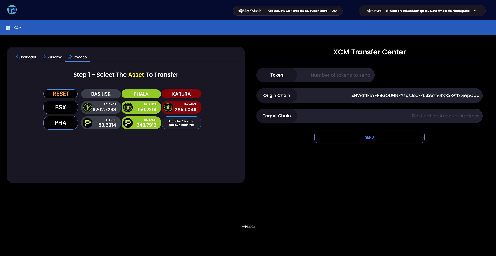
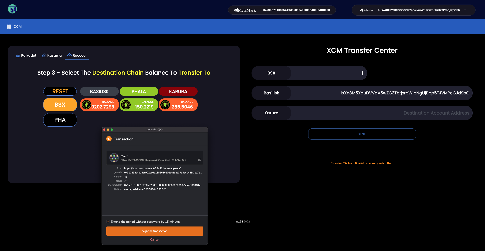

## Use any of this as you like but at your own risk. This a  submission for bounty, not a production battle tested and audited software

<br>

## Table of Contents
1. [General Info](#general-info)
2. [Website](#website)
3. [Demo Video](#demo-video)
4. [Installation](#installation)
5. [Using the Front End](#using-the-front-end)
6. [Technical](#technical)
### General Info
***
<p>This repo contains software that allows the user to experiment and make XCM transfers in the Rococo testnet environment.</p>
<p>Futhermore, it contains detailed code in regards to functions, objects and setups showing to any developer what functions have to be called and how XCM transfers can be expanded in more parachains and assets
</p>
<p>
At the time of writing this software although HRMP channels have been openened between Basilisk and several parachains there was not a token generation event and therefore impossible for us to develop on Kusama/Polakdot for Basilisk/HydraDX.
</p>
<p>
The Basilisk team has provided to us an environment of three parachains in Rococo Basilisk, Karura and Phala along with respective faucet tokens so we can develop and conducT XCM transfers
</p>
<p>
The Basilisk team has provided an environment of three parachains in Rococo Basilisk, Karura and Phala along with respective faucet tokens so we can develop and conducT XCM transfers
</p>
<p>
In addition to a user interface that allows Rococo XCM transfers we have added a full working User Interface for the Kusama ecosystem we developped for another bounty as well. It only fits natural to have all ecosystems within the same user interface. This also smoothens the transition for develpers from Rococo testnetn to Kusama mainnent and also expands further on showing how more parachains and assets can be added easily
</p>
<br>

### Website
***
<p>
We have deployed a website at 
<a href="https://intense-escarpment-02481.herokuapp.com" target="_blank">https://intense-escarpment-02481.herokuapp.com</a>
to showcase our bounty software
</p>
<p>
Please make sure you have polkadot wallet Chrome extension installed
</p>
<p>
Please make sure you have metamask  wallet Chrome extension installed and connected to Moonriver parachain if you want to use the Kusama ecosystem UI
</p>
<p>
The website has been developed to be compatible for 27" screen (anythign above 24" should be fine)
</p>
<br>

### Demo Video
***
<p> A demo video can be found at ******** TODO ******** </p>
<br>

### Installation
***
Create a new folder and inside it
```bash
$ git clone https://github.com/Entity54/AmsterDOT_Basilisk_CrossChainTransfer
$ cd AmsterDOT_Basilisk
$ yarn
$ npm start
```

<br>

### Using the front end
***
<p>
As soon as the user lands on the website the Polkadot.js and metamask extensions pop up asking for approval to use with this website. Please ensure that the Metamask is connected to the Moonriver chain for the Kusama ecosystemt. For Rococo the Meta Mask wallet is not used
</p>
<p>
The user sees the Polakdot and Metamask accounts to be used. If another polkadot account is desired choose from the top right dropdown (for metamask choose diectrly on your metamask extension).
</p>
<p>
On the left part of the screen we can see the assets and parachains supported. In Rococo XCM transfers for BSX and PHA assets aare supported across the Basilisk, Phala and Karura parachains
</p>
<p>
Having selected the desired Polkadot account from the top right dropdown the balances of this account across all asssets and parachains is loaded
</p>
<p>
The user selections on the left part of the screen will be reflected on the right part of the screen preapring the XCM transaction
</p>

<br>
<p>Lets try our first XCM transaction. </p>
<br>


<br>

<br>
<p>
Choose the asset you want to transfer  e.g. BSX. This will be highlighted in orange and the bottom row options will be hidden to emphasize the next available options. The right part opf the screen changes from "Token" to "BSX
</p>
<br>


<br>

<p>
Select the origin chain that you want your BSX to be transferred from e.g. Basilisk Tab. This is highlighted in dark orange and the right part of the screen replaces "Origin Chain" with "Basilisk. Furthermore the rest of the tabs on the same row will remain visible or not depending on whether the relevant HRMP channel is available or not
<br>
Notice that the maximum available balance to transfer prefills the quantity to transfer. The user can of course change that
In addition the correct format of your substrate account for the orgin chain is preloaded.
</p>
<br>


<br>
<p>
Select the destination chain you want to transfer your asset to. Lets choose Karura. Immediately this tab turn dark orangem, the destination chain is prefilled and the same Substrate accoutn the user has chose is shown in the destination chain format (of course the user can choose to send his asset to any address he prefers but as a default his own address at the destination parcahin is prefilled)
</p>
<br>


<br>
<p>
Note: If the user clicks again or clicks reset the webpage will reset to the intial conditions
</p>

<br>
<p>
That's it! Click send and sign the transaction when the Polkadot Wallet Extesnion pops up
</p>


<br>
<p>
The user is immediately notified that his transaction for the XCM transfer has been submitted
</p>

<br>
<p>
Once the two parachains (origin and destination parachain) mine the relevant transactions, then the relevant origin chain extrinsic hash, block hash and XCMP message is shown
</p>
<p>
Finally the balances are updated
</p>


<br>

> TIP: How about making an exotic XCM transfer, like transfering BSX from Karura to Phala !!!

<br>
<br>
<br>


# Technical
 

## Supported Chains and Assets
***
### __Rococo__
1. __Parachains__ 
* Basilisk
* Phala
* Karura
2. __Assets__
* BSX
* PHA

<br>

## Setup.js
<p>
The core of the code that handles functions to build and submit XCM transfers along with setting up Routes and APIs logic resides at Setup.js
<br>
This is then called from App.js and front end UI components 
</p>
<br>

## Setting up the APIs

<br>
<p>At App.js Lines 165 to 175 we find the code that calls Setup.js to setup the parchain rpcs </p>

__App Lines 2295 to 2328__ 
```js
const { api: api_Rococo_Karura } = await setup_SubstrateChain("Rococo_Karura");
// console.log("api_Rococo_Karura: ",api_Rococo_Karura);
setApi("Rococo_Karura", api_Rococo_Karura);

const { api: api_Rococo_Basilisk } = await setup_SubstrateChain("Rococo_Basilisk");
// console.log("api_Rococo_Basilisk: ",api_Rococo_Basilisk);
setApi("Rococo_Basilisk", api_Rococo_Basilisk);

const { api: api_Rococo_Phala } = await setup_SubstrateChain("Rococo_Phala");
// console.log("api_Rococo_Phala: ",api_Rococo_Phala);
setApi("Rococo_Phala", api_Rococo_Phala);
```

<br>
<p>At Setup.js we create the api rpc connections and store these in variables to be used for subsmitting transactions to relevant parachains</p>

__Setup.js Lines 2295 to 2328__ 
```js
const setup_SubstrateChain = async (wsURL = 'MoonbaseAlpha') => {
  console.log("setup_Moonbeam is RUN");

  let WS_URL;
  //mainnet
  if (wsURL === 'Moonriver')     WS_URL = 'wss://wss.moonriver.moonbeam.network'; 
  ...
  //testnets
  ...
  else if (wsURL === 'Rococo_Phala')         WS_URL = 'wss://rhala-api.phala.network/ws'; 
  else if (wsURL === 'Rococo_Basilisk')      WS_URL = 'wss://rpc-01.basilisk-rococo.hydradx.io'; 
  else if (wsURL === 'Rococo_Karura')        WS_URL = 'wss://karura-rococo.aca-dev.network'; 

  const wsProvider = new WsProvider(WS_URL);

  // Wait for Provider
  const api = await ApiPromise.create({ provider: wsProvider });
  await api.isReady;
  console.log(`api => : `,api);
  return {api};
};
```
<br>
<p>Storing apis into variables</p>

__Setup.js Lines 20, 28 to 52__ 

```js
let Rococo_RhalaApi, Rococo_BasiliskApi, Rococo_KaruraApi;

const setApi = (apiName, api) => {
  if (apiName==="Kusama") KusamaApi = api;
  ...
  else if (apiName==="Rococo_Phala")    { Rococo_RhalaApi    = api; apiObj["r2004"] = api; }
  else if (apiName==="Rococo_Basilisk") { Rococo_BasiliskApi = api; apiObj["r2090"] = api; }
  else if (apiName==="Rococo_Karura")   { Rococo_KaruraApi   = api; apiObj["r2000"] = api; }
}

const apiObj = {
                "2000" : null,
                "2023" : null,
                "2092" : null,
                "2004" : null,
                "2090" : null,
                "2007" : null,
                "r2004" : null,
                "r2090" : null,
                "r2000" : null,
               }
```

> TIP: For any new parachain we want to add, we need the relevant WS_URL and the parachain code which can be obtained from here:
<br>
 [https://polkadot.js.org/apps/?rpc=wss%3A%2F%2Fkusama.public.curie.radiumblock.co%2Fws#/parachains](https://polkadot.js.org/apps/?rpc=wss%3A%2F%2Fkusama.public.curie.radiumblock.co%2Fws#/parachains)

<br>

## Setting up the Assets

<br>
<p>For each asset we want to XCM transfer we need certain specifications that characterise it.</p>
<p> The type of specifications varies dependent in which parachain this asset is the parachain native token.</p>
<p> Some example of type of specification are the GeneralKey of the asset, the Pallet Id of the asset or the asset u128 id of the asset. This is entirely dependant on how the parachain has setupits own version of xcm pallet</p>
<p>For Rococo and the chise parachains we will focus on the GeneralKey of the asset</p>

<p>General Keys of assets and asset's native parachain</p>

__Setup.js Lines 53 to 65__ 
```js
const generalKeyWithout_0x = {
                              "KAR"  : "0080",
                              "BSX"  : "00000000",
                              "PHA"  : "N/A",
                               ...
                             };
const tokenBirthChain     = {
                              "KAR"  : 2000,
                              "BSX"  : 2090,
                              "PHA"  : 2004,
                              ...
                             };     
```

> TIP: For any new asset go to its native parachain URL or other parachain URL that supports the asset for XCM transfers and within Developer>Chain state> modules asset information about its GeneralKey or Pallet instance or Currency id can be found. Here is an example for BSX having GeneralKey: 0x00000000 that can be found at the Karura Rococo in the assetRegistry>foreignAssetLocations 
<br>
 [https://polkadot.js.org/apps/?rpc=wss%3A%2F%2Fkarura-rococo.aca-dev.network#/chainstate](https://polkadot.js.org/apps/?rpc=wss%3A%2F%2Fkarura-rococo.aca-dev.network#/chainstate)

<br>
<br>


## Setting up Routes  

<p>Moving over to ntt54_QuickTrade.js file we can find object xcmRoutes</p>
<p>
In this object we set up the routes that defines for each asset from what orgin destination it can transferred from to what destination chain. This is acting as a map to see what xcm transfers are possible
</p>
<p>
For example for asset "BSX" we can see that when the origin chain is Basilisk it can be transferred to Karura or Phala.
</p>
<p>
In a more exotic xcm transfer we can see that BSX can be trabsferred from an account in Karura to Phala and vice versa
</p>


__ntt54_QuickTrade.js Lines 16 to 64__ 
```js
const xcmRoutes = {
                    ...
					"PHA": {
								"Phala"    : ["Karura", "Moonriver", "Basilisk"], 
								"Karura"   : ["Phala", "Moonriver"],
								"Moonriver": ["Phala", "Karura"], 

								"Basilisk" : ["Phala"], 
							 },
                    ...
					"BSX": {
						        "Basilisk" : ["Karura", "Phala"], 
								"Karura"   : ["Basilisk","Phala"],      
								"Phala"	   : ["Basilisk","Karura"], 
							 }
				};
```


<br>

## Setting up parchainCodes and tokens in the tokeList

<p>Each parachain has a unique id number. This helps us identifying the location of its native asset but also to pointas the destination parachain in an XCM transfer. If a new parachain needs to be addedm then the relevant parchain code needs to be added to the parachainCodes object</p>
<p>Any new asset needs to be added to the tokenList
</p>


__ntt54_QuickTrade.js Lines 68 to 83__ 
```js
const parachainCodes = {   
							//mainnets
							Moonriver: 2023,   
							Karura   : 2000,
							Kintsugi : 2092,
							Phala    : 2004,
							Basilisk : 2090,
							//testsnets 
							MoonbaseAlpha   : 1000,
							KaruraAlphanet  : 2000,
							Karura_Rococo   : "r2000",
							Rhala_Rococo    : "r2004",
							Basilisk_Rococo : "r2090"
						}	
						
const tokenList = ["KSM","KAR","AUSD","KINT","KBTC","PHA","MOVR","BSX"];
```

<br>
<br>
<br>


## Functions to call for XCM transfers
<p>Within ntt54_QuickTrade.js and then transferBalance function, we can find all relevant functions to be called for any supported asset and route
</p>
<p>Focusing on transfers on BSX the relevant lines arefrom 1408 to 1556 covering all supported routes for transfering BSX
</p>
<p>
When sending BSX via XCM from Basilisk to another parachain there are many functions supported reflecting the functions found in the xTokens pallet module
</p>
<p>
Below we can see 6 different ways of transfering BSX from Basilisk to Karura
</p>

```js
//Alternative Method1 *** tranfer ***/
rococo_transfer_currency("BSX", parachainCodes.Karura, sendToAddress, amount)

//Alternative Method2 *** tranferWithFee ***/
rococo_transfer_currencyWithFee("BSX", parachainCodes.Karura, sendToAddress, amount, 1)

//Alternative Method3 *** tranferMultiCurrencies ***/
rococo_transfer_multiCurrencies("BSX", parachainCodes.Karura, sendToAddress, amount)

//Alternative Method4 *** tranferMultiAssets ***/
rococo_transfer_MultiAssetS_FromParachainToParachain("BSX", parachainCodes.Basilisk_Rococo, parachainCodes.Karura, sendToAddress, amount)

//Alternative Method5 *** tranferMultiAssetWithFee ***/
rococo_transfer_MultiAssetWithFee_FromParachainToParachain("BSX", parachainCodes.Basilisk_Rococo, parachainCodes.Karura, sendToAddress, amount, 1)

//Alternative Method0 *** tranferMultiAsset ***/
rococo_transfer_Asset_FromParachainToParachain("BSX", parachainCodes.Basilisk_Rococo, parachainCodes.Karura, sendToAddress, amount)
```

<br>
<p>
The standard function we prefer for its simplicity and generic use, is the last one Method0(rococo_transfer_Asset_FromParachainToParachain) , in which the user provides the asset "BSX, theorgin parachain code, destination parachain code, the account to send BSX to and the amount 

```js
rococo_transfer_Asset_FromParachainToParachain("BSX", parachainCodes.Basilisk_Rococo, parachainCodes.Karura, sendToAddress, amount)
```
</p>

<br>
<p>
In Method5(rococo_transfer_MultiAssetWithFee_FromParachainToParachain) the only difference is we also define the fees to transfer
</p>
<p>
In Method4(rococo_transfer_MultiAssetS_FromParachainToParachain) and Method3 (rococo_transfer_multiCurrencies) we can expand and send multiple asset or currencies with only one XCM transaction but also defining which of these assets will be the one to pay fees at the destination parachain.
<br>Note: When using these functions we need to know what assets the destination parachain accepts as eligible to pay the fees
</p>
<p>
Method1(rococo_transfer_currency) is the simplest of all to use as only the destination parachain code, account to send BSX to and amount are required
</p>
<p>
Method2(rococo_transfer_currencyWithFee) is tvery similar to Method1(rococo_transfer_currency) but with the added argument of stating the fees we want to pass along with the XCM transfer
</p>

> TIP: Find the code block below and comment  rococo_transfer_Asset_FromParachainToParachain and uncomment any other Method to see the XCM transaction

<br>

__ntt54_QuickTrade.js Lines 1408 to 1556__ 
```js
//#region baseCurrency BSX
...
else if (baseCurrency==="BSX")
{
    if (orginChain==="Basilisk" && targetChainDestination==="Phala")
    {
        ...
    }
    else if (orginChain==="Basilisk" && targetChainDestination==="Karura")
    {
        console.log(`We are sending BSX from Basilisk to Karura inputTranferAmount:${amount} sendToAddress:${sendToAddress}`);
        setTransfer_IsSubmiting(true);
        setTransactionMessage(`Transfer BSX from Basilisk to Karura, submitted.`);

        // Equivalent for Kusama UI
        // transfer_Asset_FromParachainToParachain("BSX", parachainCodes.Basilisk_Rococo, parachainCodes.Karura, sendToAddress, amount)

        //Alternative Method1 *** tranfer ***/
        // rococo_transfer_currency("BSX", parachainCodes.Karura, sendToAddress, amount)

        //Alternative Method2 *** tranferWithFee ***/
        // rococo_transfer_currencyWithFee("BSX", parachainCodes.Karura, sendToAddress, amount, 1)

        //Alternative Method3 *** tranferMultiCurrencies ***/
        // rococo_transfer_multiCurrencies("BSX", parachainCodes.Karura, sendToAddress, amount)

        //Alternative Method4 *** tranferMultiAssets ***/
        // rococo_transfer_MultiAssetS_FromParachainToParachain("BSX", parachainCodes.Basilisk_Rococo, parachainCodes.Karura, sendToAddress, amount)

        //Alternative Method5 *** tranferMultiAssetWithFee ***/
        // rococo_transfer_MultiAssetWithFee_FromParachainToParachain("BSX", parachainCodes.Basilisk_Rococo, parachainCodes.Karura, sendToAddress, amount, 1)

        //Alternative Method0 *** tranferMultiAsset ***/
        rococo_transfer_Asset_FromParachainToParachain("BSX", parachainCodes.Basilisk_Rococo, parachainCodes.Karura, sendToAddress, amount)
        .then((resolveMsg) => {
            setTransactionMessage(
                    resolveMsg.map((msg, index) => {
                        return ( <p key={index}>{msg}</p> )
                    })
            );

            setTimeout(() => { getROCOCO_AllBalancesAndAccountFormats(polakdotAccountSigner.address, accountList[0]); },10000);
            setTransfer_IsSubmiting(false);
            setInputTranferAmount("");  resetAll();
        })
        .catch((rejectMsg) => console.log(rejectMsg));
    }
    else if (orginChain==="Phala" && targetChainDestination==="Basilisk")
    {
        ...
    }
    else if (orginChain==="Karura" && targetChainDestination==="Basilisk")
    {
        ...
    }
    else if (orginChain==="Karura" && targetChainDestination==="Phala")
    {
        ...
    }
    else if (orginChain==="Phala" && targetChainDestination==="Karura")
    {
        ...
    }

}
//#endregion
```

<br>

> TIP: To find the code with the actual extrinsics being prepared, signed and sent look at Setup.js Lines 1500 to 2290. <br>Inside these lines and for each function we can find all events emitted during an XCM transfer e.g. Lines 2251 to 2277 along with any thrown errors e.g. Lines 2230 to 2245.
<br>Since any of the Methods described above is a promise, when this resolves it returns a message with the Extrisnic Hash, Block Hash and XCMP message of the XCM transfer.

<br>


## Retrieving Asset Balances in parachains

<p>Once an XCM transfer promise using any of the methods above resolves we use the function getROCOCO_AllBalancesAndAccountFormats which takes as arguments the selected polkadot and metamask accounts and is situated at component DEX.js
</p>

__DEX.js Lines 48 to 93__ 
```js
const getROCOCO_BalancesAndAccountFormats = async (account, token=null, metamaskAccount=null, network=null ) => {
    console.log(`Getting ROCOCO account formats for account: ${account} and balance for token: ${token} metamaskAccount: ${metamaskAccount} for network:${network} (if null we get balances for all supported networks)`);
    const response = await getRococo_AvailableBalance(account, token, metamaskAccount, network);
    return response
}

...

const getROCOCO_AllBalancesAndAccountFormats = async (account, metamaskAccount) => {
    const basiliskResponse = await getROCOCO_BalancesAndAccountFormats(account, "BSX", metamaskAccount);
    if (basiliskResponse)
    {
        const {accounts, balances: balancesBSX} = basiliskResponse;
        const {balances: balancesPHA}           = await getROCOCO_BalancesAndAccountFormats(account, "PHA", metamaskAccount);
        // const {balances: balancesKAR}           = await getROCOCO_BalancesAndAccountFormats(account, "KAR", metamaskAccount);
        
        setAccountFormats(accounts);
        
        setRococoBalancesBSX(balancesBSX);
        setRococoBalancesPHA(balancesPHA);
        // setRococoBalancesKAR(balancesKAR);
        return { BSX:balancesBSX, KAR: null, PHA:balancesPHA,};
        // return { BSX:balancesBSX, KAR: balancesKAR, PHA:balancesPHA,};
    } else { console.log(`getROCOCO_AllBalancesAndAccountFormats Some API Sockets are not ready`); return }
} 
```


<br>
<p>
These functions call the function getRococo_AvailableBalance at Setup.js that retrieves balances for a given account and token across all supported parachains
</p>


__Setup.js Lines 2600 to 2690__ 
```js
const getRococo_AvailableBalance = async (account, token=null, metamaskAccount, network=null) => {
  ...
  const accounts = getAccountFormatsforAccountI32(account);
  const {basilisk_Address, karura_Address, khala_Address } = accounts;

  if (token.toLowerCase()==="bsx") 
  {
    const timestamp = await Rococo_BasiliskApi.query.timestamp.now();   

    //Basilisk
    const { nonce, data: balance } = await Rococo_BasiliskApi.query.system.account(basilisk_Address);   // Retrieve the account balance & nonce via the system module
    let BasiliskBalance = null;
    if (balance) 
    BasiliskBalance = Number( ethers.utils.formatUnits( (balance.free).toString(), 12) ).toFixed(4)

    //Karura
    const {free: free1 , reserved: reserved1, frozen: frozen1}  = await Rococo_KaruraApi.query.tokens.accounts(karura_Address, {ForeignAsset: 2});    
    const KaruraBalance = Number( ethers.utils.formatUnits( free1.toString(), 12) ).toFixed(4)
  

    // Phala
    const Phala_balanceObj = await Rococo_RhalaApi.query.assets.account( 5,  khala_Address ); 
    let PhalaBalance = null;
    if (Phala_balanceObj.toJSON()) 
    PhalaBalance = Number( ethers.utils.formatUnits( (Phala_balanceObj.toJSON()).balance, 12) ).toFixed(4);
    
    const balances = {token, timestamp: new Date(timestamp).toISOString, Basilisk: BasiliskBalance,  Karura: KaruraBalance, Phala: PhalaBalance };
    console.log(`ROCOCO =====> balances: `,balances);

    return {accounts, balances};
  }
  else if (token.toLowerCase()==="kar") 
  {
      ...
  }
  else  if (token.toLowerCase()==="pha") 
  {
      ...
  }
} 
```
